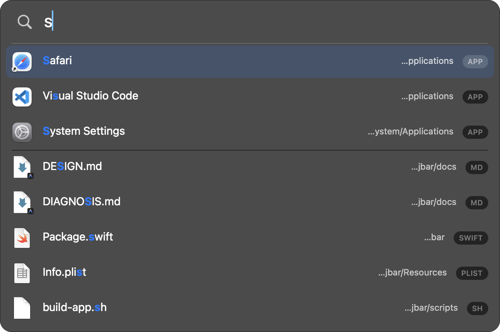

<div align="center">

# JBar

**A keyboard-first, local filename launcher for macOS.**

[](https://github.com/linjiw/jbar/actions/workflows/ci.yml)
[](LICENSE)
[](#requirements)
[](https://swift.org)
[](#design)

[Evidence](docs/COMPARISON.md) · [Design](docs/DESIGN.md) · [Support matrix](docs/SUPPORT.md) · [Privacy](docs/PRIVACY.md) · [Why not Spotlight?](docs/DIAGNOSIS.md) · [UX tests](docs/UX-TESTS.md)



</div>

---

Press **⌥Space**, type, then press **Return**. JBar builds a bounded local index of the configured app and file roots and ranks names for launching. It does not depend on Spotlight for normal search, and it does not search file contents.

JBar does not request Accessibility, Input Monitoring, or Full Disk Access. macOS can still show standard Files and Folders consent prompts when a configured root includes protected locations such as Desktop, Documents, or Downloads.

> **Release status:** JBar is currently a development preview built from source. The intended contract is macOS 13+, Apple Silicon and Intel from one Universal 2 app, with any system language/input source and an English v1 interface. Automated regressions exist, but the required physical Mac/input-method matrix and the Developer ID notarized release gate are still pending. See [SUPPORT.md](docs/SUPPORT.md).

## Why

A Spotlight failure on the original development machine motivated JBar: after an unclean shutdown, ordinary Downloads files were absent from Spotlight results while its system-wide content index rebuilt. The full machine-specific investigation is in [DIAGNOSIS.md](docs/DIAGNOSIS.md).

JBar deliberately solves a narrower problem: search configured filenames and application aliases, exclude dependency/cache trees, and rank likely launch targets. Spotlight remains the better tool for searching inside documents and across its broader system index.

## Current performance evidence

The benchmark uses report schema v1, workload v2, deterministic fixture generator v2, and a
deterministic in-memory production-stage-2 frecency profile. Every timed response is checked against
complete ordered rows and its exact total when it is expected to complete; deliberately superseded
older requests are checked for cancellation. Fingerprints are report identities, not correctness
oracles. The following synthetic results are ranges of the process-level nearest-rank statistics from three sequential,
independent release processes per size, with 100 observations per workload in each process:

| Items | engine-cache-cold `x`: p50 / p95 / p99 / worst max (ms) | typing `r`: p50 / p95 / p99 / worst max (ms) | supersession newest `chrome`: p50 / p95 / p99 / worst max (ms) |
|---:|---:|---:|---:|
| 300,000 | 43.689–55.232 / 49.349–57.592 / 49.470–59.391 / 59.413 | 71.341–84.240 / 76.207–92.882 / 77.723–98.259 / 100.719 | 13.419–14.085 / 14.770–16.891 / 14.867–17.316 / 23.740 |
| 500,000 | 90.123–90.996 / 96.980–97.031 / 98.619–98.682 / 99.343 | 132.956–143.578 / 148.162–156.551 / 156.403–172.096 / 181.244 | 22.625–24.058 / 25.698–27.505 / 26.353–28.802 / 29.407 |
| 1,000,000 | 171.521–181.592 / 178.376–188.499 / 179.651–189.826 / 193.135 | 251.063–269.888 / 268.004–291.179 / 270.453–306.044 / 320.136 | 40.284–45.404 / 47.079–50.047 / 48.457–52.138 / 53.612 |

At each size, all 300 older superseded scans cancelled as intended and none of the 300 newest scans
cancelled unexpectedly. High-tail samples are retained; this is observational data, not an absolute
latency gate. The current formal campaign intentionally ran synthetic fixtures only. An opt-in real
crawl and the semantically different Spotlight reference remain available, but figures from an older
binary are not presented as current release evidence.

The run was generated at 2026-08-21T00:20:08Z on a Mac16,12 with an Apple M4, 10 active processors,
16 GiB memory, arm64, macOS 26.5.2 (25F84), Xcode 26.2 (17C52), and Swift 6.2.3. All nine reports used
the same optimized arm64 binary (`SHA-256
ec4496606f09e30f3ac5ea65b8fcdd16a7c77d8e21b1402f508b73d93356654f`) built from the clean
candidate commit `183fc3c2e526e21dccc7976203e5f00ba371426c`. The frozen source-manifest file hashes to
`7da3d07f27a0da2b128c3acc38876fcf8f5136b9a9626e246ee878a0915fdead`, the tooling-manifest file to
`7b78ccb538ef93e6cc237b1069a37f8d2946a18154b911fbd102499058c8590f`, and the final `SHA256SUMS`
file to `7a64cb87f45e11a04b116be1a05c78e6da3077e9cf5f422fcd23a86c070de6ab`. This is local development
evidence from a precisely recorded clean candidate, not a notarized release artifact or a cross-machine SLA. See
[COMPARISON.md](docs/COMPARISON.md) for provenance and workload identities.

```bash
# Deterministic 300k, 500k and 1M fixtures; three sequential release processes per size.
scripts/benchmark-release.sh 100

# Add one isolated real cold crawl and same-root Spotlight reference.
JBAR_BENCHMARK_INCLUDE_REAL=1 scripts/benchmark-release.sh 100
```

## Development install

The current install path is for developers and requires macOS 13+ plus Xcode command-line tools:

```bash
git clone https://github.com/linjiw/jbar.git
cd jbar
make install
```

This builds a Universal 2 release app by default, ad-hoc signs it, validates it in a same-volume staging location, then installs it in `/Applications` or `~/Applications`. An ad-hoc build is not a public release and must not be distributed as though it were notarized. Do not strip quarantine to bypass Gatekeeper.

A Homebrew Cask is the intended convenience channel after the exact ZIP is Developer ID signed, notarized, stapled, and clean-machine validated. npm or a rewrite in another language would not bypass macOS signing, TCC, architecture, or OS-version requirements; Swift/AppKit is the smallest native implementation for this app.

## Usage

| You type | You get |
|---|---|
| `vsc`, `code` | Visual Studio Code (acronym + fuzzy matching) |
| `xc` | Xcode |
| `微信`, `weixin`, `wx` | a matching localized app name or pinyin alias |
| `报告` | Chinese-named documents |
| `report pdf` | multi-term results, including extension matches |
| `~/Dow` then `Tab` | live path browsing |
| `.md` | extension-only search |

Application rows use Finder's display name for the current locale and retain bundle/plist/localized names as searchable aliases. JBar's own labels and messages are currently English-only.

### Keys

| Key | Action |
|---|---|
| `↑ ↓` / `⌃N ⌃P` | move selection; scrolling continues beyond the visible rows |
| `Page Up` / `Page Down` | move by the number of rows that actually fit on the current screen |
| `Return` | open |
| `⌘Return` | reveal in Finder |
| `⌘C` | copy the selected path, unless text is selected in the query field |
| `⌘1`–`⌘8` | open result 1–8 using the physical top-row number keys |
| `Tab` | autocomplete a folder into path-browsing mode |
| `Esc` | close after any active input-method composition has finished |
| `⌘,` | open the config file |

Control by itself and the physical Delete key do not close the panel. While an IME has marked text, JBar returns Escape, Command shortcuts, navigation, and editing commands to AppKit's text-input system. This behavior is covered by automated policy/marked-text fixtures, but the physical Sequoia Chinese, Korean, Japanese, and keyboard-layout matrix remains a release gate.

### Result pool, viewport, and path mode

Normal search requests at most `maxResults` rows (40 by default). The current bounded rerank window can produce at most 300 scored normal/extension rows even if `maxResults` is configured higher. `visibleRows` controls only how many rows are shown without scrolling (8 by default); on a short screen, one geometry calculation reduces the effective row count and uses that same count for panel height, overflow indication, and page movement.

Path mode streams a directory and retains a bounded best-result pool instead of materializing every entry. It currently keeps at most `maxResults × 4` rows, while still counting matches if enumeration completes. A `PATH · shown/total` badge makes truncation visible; `PATH · ?` means the directory could not be read completely.

## Configuration

Hand-edit `~/.config/jbar/config.json` (or `$XDG_CONFIG_HOME/jbar/config.json` when `XDG_CONFIG_HOME` is absolute). The file is created on first launch and hot-reloaded. Invalid or unsafe values keep the last valid configuration and surface a warning.

| key | default | meaning |
|---|---:|---|
| `hotkey` | `"option+space"` | fixed US-ANSI physical key names; input-source changes do not move the binding |
| `launchAtLogin` | `true` | register via `SMAppService` when installed in an Applications folder |
| `maxResults` | `40` | requested scrollable pool (`1...500`); scored normal/extension results currently cap at 300 |
| `visibleRows` | `8` | requested viewport height (`1...20`, reduced if the screen is shorter) |
| `appsFirstCap` | `5` | app slots before file results (`0...maxResults`) |
| `screen` | `"mouse"` | `mouse`, `main`, or `active`; unknown values fall back to mouse |
| `restoreQueryOnReopen` | `false` | preserve the previous query when reopening |
| `showRecentsOnEmpty` | `true` | show local frecency history for an empty query; `false` shows only the hint |
| `fileRoots` | `["~"]` | roots to index (at most 128) |
| `excludeNames` / `excludePaths` | see [DESIGN.md](docs/DESIGN.md) | never descend into matching entries |
| `downrankNames` | build/dist/vendor/… | index but rank lower |
| `includeHidden` | `false` | include dot-files in the persistent index |
| `maxDepth` | `12` | crawl depth (`0...64`) |
| `maxIndexedItems` | `1000000` | shared app+file hard cap (`1...2000000`) |

There is no `useSpotlightFallback` setting. Spotlight is used only by the explicit benchmark reference, not by interactive search.

To reuse **⌘Space**, first disable “Show Spotlight search” in System Settings → Keyboard → Keyboard Shortcuts → Spotlight, then set `"hotkey": "cmd+space"`.

## Privacy

The index, configuration, and frecency history stay on the Mac. The persistent index contains filename/path metadata, not document contents. History contains exact opened paths and normalized query-pick strings, so it can still be sensitive. See [PRIVACY.md](docs/PRIVACY.md) for locations, retention, permissions, logging, clipboard behavior, and precise clear steps.

## Design

```text
Hotkey (Carbon)  →  NSPanel + NSTableView  →  SearchEngine (actor)
                                                    ↓ reads
                          IndexStore  ←  AppScanner · Crawler · FSEvents · Snapshot
```

- `JBarCore` contains configuration, the bounded flat index, crawler, snapshot, query parser, scorer, ranking, pinyin aliases, and frecency.
- `JBarApp` contains the AppKit panel, Carbon hotkey, menu-bar integration, launch actions, and CLI/benchmark entry points.
- Search and directory work run off the main thread; newer requests supersede older scans.
- Index and history files are atomically replaced with owner-only permissions and bounded reads.

See [DESIGN.md](docs/DESIGN.md) for the current implementation contract and known release gaps.

## Development and validation

```bash
swift test
swift test -c release

# Assemble the default ad-hoc Universal 2 development bundle.
scripts/build-app.sh

# Explicit isolated path-mode latency gate (release only).
JBAR_RUN_PATH_BENCHMARK=1 swift test -c release \
  --filter PathModeStreamingTests/testPathModeTwentyThousandIsolatedReleaseBenchmark

# Packaged AppKit lifecycle/event smoke. The source app is read-only; the script runs a private clone.
scripts/tests/appkit-smoke.sh /absolute/path/JBar.app
```

Test counts are intentionally not copied into documentation because they change frequently. The
packaged smoke drives synthetic Control `flagsChanged`, text, Delete, Down, and Return events through
a real `NSApplication`, but uses an in-memory fixture and recording workspace in an ad-hoc private
clone. It does not exercise a physical keyboard/IME, the real workspace or LaunchServices, the global
hotkey, production index/history, login item, Gatekeeper, or notarization. Universal build checks can
inspect both slices and the macOS 13 minimum. CI is configured to repeat packaged CLI and synthetic
AppKit checks on its listed native arm64 and x86_64 hosted runners; a local Rosetta CLI launch alone
is not native Intel AppKit evidence, and even a hosted synthetic smoke is not physical keyboard/IME
or clean-machine Gatekeeper proof. A green suite therefore does not complete the physical
input-method, OS-version, signing, notarization, or Gatekeeper matrix. Follow
[UX-TESTS.md](docs/UX-TESTS.md), [SUPPORT.md](docs/SUPPORT.md), and
[RELEASING.md](docs/RELEASING.md) before publishing.

## Uninstall

```bash
make uninstall
make uninstall PURGE=1    # prompts before deleting config, cache, and history
```

For selective data clearing without uninstalling, use the exact-file steps in [PRIVACY.md](docs/PRIVACY.md).

## Troubleshooting

- **Gatekeeper warning:** do not remove quarantine from a downloaded build. Until a signed and notarized release exists, build the development version from a trusted source checkout.
- **Hotkey does nothing:** another app may own it. JBar warns in the menu and attempts `ctrl+option+space` as a fallback.
- **A protected folder is absent:** check System Settings → Privacy & Security → Files and Folders for JBar.
- **Rebuild the index:** choose **Rebuild Index** from the menu-bar item.
- **Diagnostics:** `log show --last 10m --predicate 'subsystem == "com.linji.jbar"' --style compact`. Current app logs omit raw queries, names, and paths; see [PRIVACY.md](docs/PRIVACY.md).

## Requirements

The intended v1 artifact targets macOS 13 Ventura or later and contains `arm64` and `x86_64` slices. Xcode command-line tools are required only for the current source-build workflow. The exact validation matrix is in [SUPPORT.md](docs/SUPPORT.md).

## License

[MIT](LICENSE) © Linji Wang
